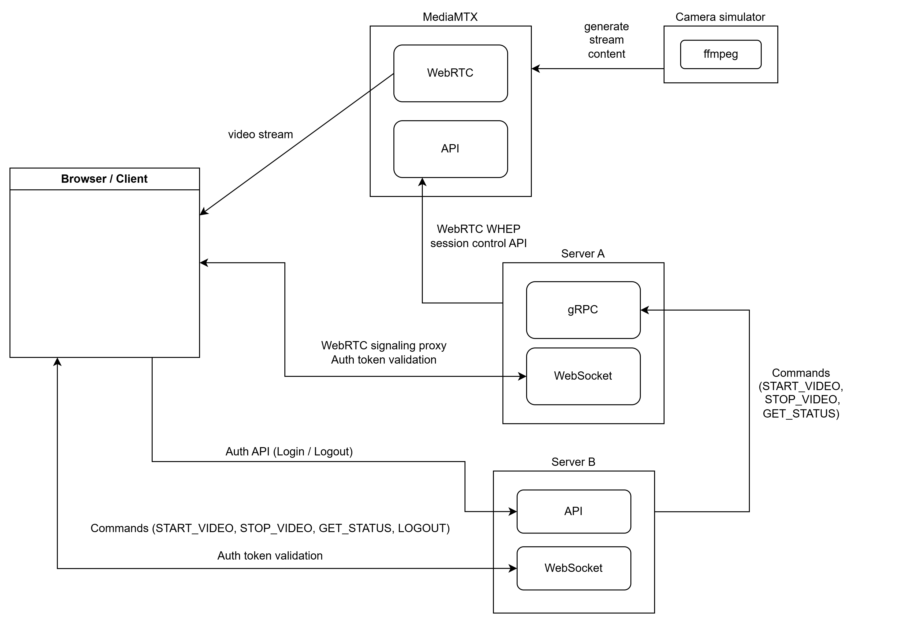

## Architecture diagram

## TODO:

1. Currently when user is signed in and initiated websocket connection removing cookie token will not prevent user to send commands and control video stream.
2. Add queue for commands on server-a
3. Implement auth for gRPC for inter server communication